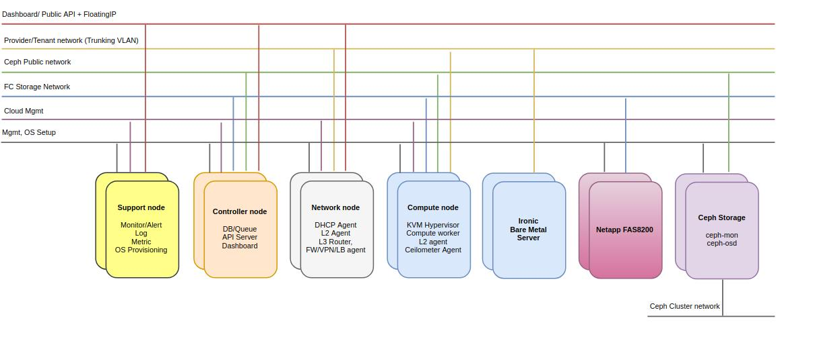
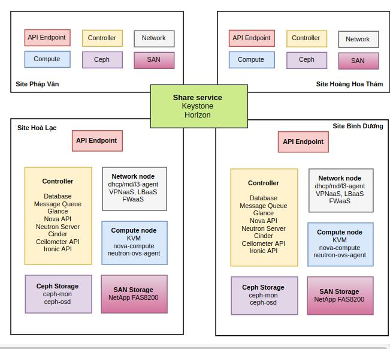
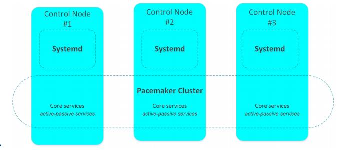

# Openstack Deployment Documentation

# Table Of Contents
- [1. Tổng quan về Openstack](#overview)
 - [1.1. Khái niệm Cloud computing và Openstack](#cloudcomputingandopenstack)
 - [1.2. Vì sao lựa chọn Openstack](#whychooseopenstack)
 - [1.3. Yêu cầu chức năng và phi chức năng](#functionalandnonfunctional)
   - [1.3.1. Yêu cầu chức năng](#functional)
   - [1.3.2. Yêu cầu phi chức năng](#nonfunctional)
- [2. Kiến trúc tổng quát](#overviewarchitecture)
 - [2.1. Thành phần bổ sung](#thirdcomponent)
 - [2.2. Compute pool](#computepool)
 - [2.3. Controller cluster](#controllercluster)
- [3. Cài đặt môi trường](#enviroment)
- [4. Scale](#scale)
  - [4.1. Database Scalability](#dbscale)
  - [4.2. Messaging service](#messservice)
  - [4.3 OpenStack Identity (Keystone)](#keystone)
  - [4.4. OpenStack Compute (Nova)](#nova)
  - [4.5. OpenStack Networking (Neutron)](#neutron)
  - [4.6. OpenStack Block Storage (Cinder)](#cinder)
  - [4.7. Database/Galera](#db/galera)
- [5. Ceph Distributed Storage](#cephstorage)

## 1. Tổng quan về Openstack

### 1.1. Khái niệm Cloud computing và Openstack
Trước khi đi vào tìm hiểu tài liệu này. Chúng ta sẽ nói qua về khai niệm của cloud computing và Openstack.

Đối với Cloud computing, dịch theo định nghĩa của Viện tiêu chuẩn và công nghệ quốc gia của Mỹ ([NIST](https://csrc.nist.gov/publications/detail/sp/800-145/final)):

`
Cloud Computing là mô hình cho phép truy cập qua mạng để lựa chọn và sử dụng tài nguyên có thể được tính toán (ví dụ: mạng, máy chủ, lưu trữ, ứng dụng và dịch vụ) theo nhu cầu một cách thuận tiện và nhanh chóng; đồng thời cho phép kết thúc sử dụng dịch vụ, giải phóng tài nguyên dễ dàng, giảm thiểu các giao tiếp với nhà cung cấp.
`

Còn đối với Openstack, được định nghĩa theo trang chủ [openstack](https://www.openstack.org/) như sau:

`
OpenStack is a cloud operating system that controls large pools of compute, storage, and networking resources throughout a datacenter, all managed through a dashboard that gives administrators control while empowering their users to provision resources through a web interface.
`

Hiểu đơn giản như sau:

`
Openstack là một hệ thống quản lý cloud mà điều khiển một số lượng lớn các tài nguyên mạng, tài nguyên lưu trữ và tài nguyên tính toán thông qua một datacenter. Tất cả những tài nguyên này được quản lý thông qua bảng điều khiển giúp quản trị viên có thể kiểm soát toàn bộ hoạt động trong khi cung cấp cho người dùng quyền để cung cấp các tài nguyên thông qua một web interface.
`

Hiên nay, Openstack đang tiếp tục có được sức hút khá lớn trong công nghiệp bởi vì sự phát triền ngày càng nhanh về tầm ảnh hưởng của cloud computing và tính mềm dẻo của các dịch vụ Openstack như là một sản phẩm mã nguồn mở có thể được triển khai trong môi trường doanh nghiệp. Tài liệu này sẽ mô tả reference architecture (RA - kiến trúc tham khảo) cho việc triển khai nền tảng Openstack trong công nghiệp. Một giải pháp quản lý cloud thông minh và chi phí thấp nhưng đạt được những yêu cầu cao về tính **automation**, **metering** và **security**. Ngoài ra, kiến trúc này còn có khả năng **scalable**, **highly available** cho việc quản lý các hoạt động cloud được áp dụng.

Tiếp theo, chúng ta sẽ đi tìm hiểu lý do vì sao Openstack là sự lựa chọn của các công ty lớn trong triển khai nền tảng cloud computing.

### 1.2. Vì sao lựa chọn Openstack
Openstack đang trở thành một sự lựa chọn tốt nhất cho các doanh nghiệp vì những lợi ích mà nói mang đến. Vậy những lợi ích là gì? Vì sao Openstack được lựa chọn để triển khai trong công nghiệp?

Dưới đây là những lý do giải thích cho câu hỏi trên:
- Openstack là một sản phẩm mã nguồn mở, có tính mềm dẻo trong triển khai, giá thành thấp và có tính mở phù hợp với nhu cầu triển khai của từng doanh nghiệp. Cụ thể là có thể thêm node để tăng khả năng sử lý, có khả năng phân vùng để tách biệt các project với nhau, có khả năng high availability,...
- History and vision: Openstack là một project mã nguồn mở phát triển nhanh nhất trong lịch sử, đến nay đã có 20 triệu dòng code được Openstack Foundation thông qua. Openstack hiện tại có hơn 34.000 contributor và hơn 550 công ty trực tiếp làm việc với Openstack, các công ty này đều là thành viên của Openstack Foudation.
- Openstack được cấp dưới giấy phép Apache, liên tục được đổi mới với các phiên bản mới. Định kỳ 6 tháng sẽ đưa ra một phiên bản mới với các thay đổi phù hợp hơn với xu hướng công nghệ.
- Hệ thống tài liệu của Openstack được thực hiện rất đầy đủ và chi tiết từ cơ bản đến nâng cao. Được triển khai với các nền tảng khác nhau (Ubuntu, Centos, RedHat,...) và với các mô hình khác nhau. Ngoài ra các tài liệu về các mô hình nâng cao cũng rất đầy đủ, chẳng hạn như Security, High Availability,....
- Có rất nhiều công ty lớn đã và đang triển khai Openstack như Rackspace, Red Hat, IBM, Cisco,...

### 1.3. Yêu cầu chức năng và phi chức năng
Để có được một Openstack deployment mạnh mẽ, có thể đáp ứng được các nhu cầu doanh nghiệp thì chúng ta cần đảm bảo được các yêu cầu về chức năng và phi chức năng sau.

#### 1.3.1. Yêu cầu chức năng
Bảng sau liệt kê các yêu cầu chức năng:

| Requirement        | Description           | Supported By  |
| ------------- |:-------------|:-----|
| Mobility     | khối lượng công việc không nằm trên bất kỳ một node nào | <ul><li>Cho phép các virtual machine được boot từ các storage phân tán</li><li>Di chuyển trực tiếp VM trong khi VM đang chạy</li><li>Chế độ rescue hỗ trợ bảo trì các server</li></ul> |
| Resource provisioning     | Virtual machine, virtual storage, virtual network có thể được tạo ra theo yêu cầu      |   <ul><li>OpenStack compute service</li><li>OpenStack block storage service</li><li>OpenStack network service</li><li>OpenStack bare-metal provisioning service</li></ul> |
| Management portal | Cung cấp một web-base cho việc quản lý các hoạt động trên cloud |  OpenStack dashboard (Horizon) |
| Multi-tenancy | Các tài nguyên được phân chia theo từng tenant (project) | Built-in segmentation và multi-tenancy trong OpenStack |
| Metering| Collect measurements of used resources to allow billing| OpenStack metering service (Ceilometer) |

#### 1.3.2. Yêu cầu phi chức năng
Bảng sau liệt kê các yêu cầu phi chức năng:

| Requirement | Description | Supported By |
| ----------- | ----------- | ------------ |
| Scalability | Các thành phần có thể được scale theo nhu cầu| Các node compute và node storage có thể được scale độc lập mà không ảnh hưởng đến toàn hệ thống |
| Load Balancing | Công việc được phân tán trên toàn bộ server | <ul><li>Sử dụng Openstack Scheduler để cân bằng các tài nguyên compute và storage trên các node</li><li>Các khối dữ liệu được phân tán trên các node storage và có thể được cân bằng lại khi có một node bị lỗi</li></ul>|
| High availability| Một thành phần đơn lẻ bị lỗi không dẫn đến toàn bộ hệ thống ngừng hoạt động| <ul><li>Kiến trúc phần cứng đảm bảo rằng compute service, storage service và network service được tự động chuyển đến các thành phần còn lại không bị lỗi</li><li>Node controller, node compute và storage node là dừ thừa cho mục đích xử lý lỗi khi một node bị lỗi</li><li>Data được lưu trữ trên nhiều server và có khả năng truy cập được từ bất kỳ node nào; Do đó, không có single server failure dẫn đến mất dữ liệu</li><li>Các virtual machine được duy trì trên storage service được chia sẻ trên các server</li></ul>|
| Mobility | Các VM có thể được di chuyển đến server vật lý khác nhau| <ul><li>VM migration</li><li>VM evacuation</li></ul>|
| Ease of installation | Hạn chế sự phức tạp trong triển khai hệ thống | Sử dụng Ansible 2.0 |
| High Performance | Cấu hình phù hợp với phần cứng | <ul><li>Sử dụng performance documentation của Openstack official để tối ưu và cải thiện hiệu năng</li><li>Tối ưu hóa phần cứng</li></ul> |

## 2. Kiến trúc tổng quát
Dưới đây là kiến trúc tổng quát của Openstack được triển khai trong môi trường doanh nghiệp của Econet:

Tiếp theo là kiến trúc logic cho mô hình 4 side triển 4 cụm Openstack:

Bảng sau sẽ liệt kê các thành phần chính của Openstack Platform được thể hiện ở hình trên.

| Component  |  Code name |  Description |
|------------|------------|--------------|
| Compute service  | Nova  | <ul><li>Quản lí các máy ảo trong môi trường OpenStack, chịu trách nhiệm khởi tạo, lập lịch, ngừng hoạt động của các máy ảo theo yêu cầu. Starting, resizing, stopping và querying máy ảo</li><li>Gán và remove public IP</li><li>Attach và detach block storage</li><li>Show instance consoles (VNC)</li><li>Snapshot running instances</li><li>Nova hỗ trợ nhiều hypervisor: KVM, VMware, Xen, Docker, etc</li></ul>   |
| Block storage service | Cinder |<ul><li>Cung cấp các khối lưu trữ bền vững (volume) để chạy các máy ảo (instances).</li><li>Kiến trúc pluggable driver cho phép kết nối với công nghệ Storage của các hãng khác.</li><li>Có thể attach và detach một volume từ máy ảo này gắn sang máy ảo khác, khởi tạo instance mới</li><li>Có thể sao lưu, mở rộng các volume</li></ul>|
| Network service  | Neutron |<ul><li>Các phiên bản trước Grizzly tên là Quantum, sau đổi tên thành Neutron</li><li>Cung cấp kết nối mạng như một dịch vụ (Network-Connectivity-as-a-Service) cho các dịch vụ khác của OpenStack, thay thế cho nova-network.</li><li>Cung cấp API cho người dùng để họ tạo các network của riêng mình và attach vào server interfaces.</li><li>Kiến trúc pluggable hỗ trợ các công nghệ khác nhau của các nhà cung cấp networking phổ biến.</li><li>Ngoài ra nó cũng cung cấp thêm các dịch vụ mạng khác như: FWaaS (Firewall as a service), LBaaS (Load balancing as a servie), VPNaaS (VPN as a service),...</li></ul>|
| Image Service | Glance | Lưu trữ và truy xuất các disk images của các máy ảo của người dùng và các cloud services khác. OpenStack compute sẽ sử dụng chúng trong suốt quá trình dự phòng instances. Các tính năng chính:<ul><li>Người quản trị tạo sẵn template để user có thể tạo máy ảo nhanh chóng</li><li>Người dùng có thể tạo máy ảo từ ổ đĩa ảo có sẵn. Glance chuyển images tới Nova để vận hành instance</li><li>Snapshot từ các instance đang chạy có thể được lưu trữ, vì vậy máy ảo đó có thể được back up.</li></ul>|
| Identity service | Keystone | Cung cấp dịch vụ xác thực và ủy quyền cho các dịch vụ khác của OpenStack, cung cấp danh mục của các endpoints cho tất các dịch vụ trong OpenStack. Cụ thể hơn:<ul><li>Xác thực user và vấn đề token để truy cập vào các dịch vụ</li><li>Lưu trữ user và các tenant cho vai trò kiểm soát truy cập(cơ chế role-based access control - RBAC)</li><li>Cung cấp catalog của các dịch vụ (và các API enpoints của chúng) trên cloud</li><li>Tạo các policy giữa user và dịch vụ</li><li>Mỗi chức năng của Keystone có kiến trúc pluggable backend cho phép hỗ trợ kết hợp với LDAP, PAM, SQL</li></ul>|
| Telemetry service | Ceilometer | <ul><li>Giám sát và đo đạc các thông số của OpenStack, thống kê tài nguyên của người sử dụng cloud phục vụ mục đích billing, benmarking, thống kê và mở rộng hệ thống</li><li>Đáp ứng tính năng "Pay as you go" của Cloud Computing</li></ul>|

Những thành phần chính này sẽ tạo nên một nền tảng Openstack có đầy đủ các chức năng cần thiết. Tuy nhiên, để một Openstack platform có thể đáp ứng được nhu cầu của doanh nghiệp, cụ thể là phục vụ cho một số lượng lớn các khách hàng, thì mô hình trên cần được trên cần được triển khai có khả năng scale. Mô hình trên cũng đã thể hiện những thành phần cần được tách biệt để đảm bảo khả năng scale.

Để có được khả năng scale, phần dưới đây sẽ đi vào từng thành phần được xây dựng để chịu được nhu cầu người dùng thay đổi.

### 2.1. Thành phần bổ sung
Ngoài các thành phần chính trong Openstack Platform, chúng ta còn sử dụng các thành phần sau với những mục đích cụ thể sau:
- MariaDB: Là một phần mềm database mã nguồn mở. MariaDB cluster là một cụm các server được đồng bộ cho mariaDB. Nó sử dụng nhân bản các sao chép giữa mỗi server trong cluster để đạt được một mô hình active-avtice multi-master. Điều này có nghĩa là, mỗi server có thể cho phép dữ liệu đến và lưu trữ nó, đồng thời một node bị lỗi thì không ảnh hưởng đến cluster.
- RabbitMQ: Là một hệ thống truyền thông điệp mã nguồn mở, mà dựa trên chuẩn AMQP. RabbitMQ là broker mặc địch và được yêu cầu sử dụng trong nền tảng Openstack.

### 2.2. Compute pool
Compute pool là khái niệm dùng để nói đến một tập hợp lớn các node compute được ảo hóa bởi Openstack Nova để cung cấp một môi trường để deploy và chạy các virtual machine (viết tắt là VM) . Mỗi lần chúng ta chạy một VM, tất cả các tài nguyên tính toán được liên kết với VM (vCPUs,RAM,HDD,...) đều được tiêu thụ từ node compute. Do đó, số lương node compute cần đạt được tính flexible (tính mềm dẻo) để có thể phục vụ cho nhu cầu của doanh nghiệp ngày càng tăng.

## 2.3. Controller cluster

Controller node là các server trung tâm cho việc quản lý Cloud platform. Controller node là nơi mà người dùng có thể truy cập đến và tạo ra các tài nguyên dựa trên cloud cho từng mục đích sử dụng của họ.

Để đạt được một Openstack Platform mạnh mẽ, các service trong Openstack Controller node cần được triển khai theo mô hình High Availability (HA). Có 3 kiểu dịch vụ được triển khai trên HA node là: *core*, *active-passive*, *systemd*. Các core service và active-passive service cần được chạy và được quản lý bởi **Pacemaker**, và tất cả các service khác được quản lý bởi **systemd**. Một số lượng lẻ các node controller sẽ được sử dụng để triển khai (tối thiểu là 3 node), bởi vì khả năng HA có được là dựa trên cùng một cơ chế bầu chọn master node của 2 công nghệ là Pacemaker và HAProxy. HAProxy được cấu hình trên các node controller sử dụng Linux để triển khai nhiều hơn một node controller. Pacemaker được sử dụng để đảm bảo rằng tài nguyên của cluster luôn luôn sẵn sàng. Nếu một node hoặc là một service bị lỗi, Pacemaker sẽ có thể restart service đó, hoặc là loại bỏ node đó ra khỏi cluster hoặc là reboot node đó thông qua HAProxy. Đối với mô hình 3 node controller, nếu 2 node bị lỗi, thì node còn lại sẽ đóng vai trò chính trong các hoạt động của node controller.

Trên đây là tất cả những thông tổng quan về hệ thống Openstack. Nhưng kiến thức rất tổng quát đối với mọi triển khai Openstack.Trong phần tiếp theo dưới đây, chúng ta sẽ đi tìm hiểu chi tiết về quá trình chuẩn bị môi trường, chi tiết về các thành phần và giải thích vì sao lại có những thành phần này và tại sao lại phải tách ra thành một node hay một cluster?

### 3. Cài đặt môi trường

Mỗi service trong OpenStack được đặt trong 1 Docker container để phân tách độc lập môi trường cũng như dễ dàng hơn trong việc quản lý nâng cấp từng service. Một số container của các service cần dùng nhiều tài nguyên như:  rabbitmq, mysql, keystone, neutron và cinder  sẽ được đặt trên các node riêng biệt để có thể nhận được nhiều tài nguyên hơn nếu cần mà không bị hạn chế bởi các services khác. 

Dưới đây là danh sách các services, bao gồm:

1. Keystone: Fernet Token.
2. Glance: Glance API và Glance Registry được lưu trên một pool riêng của Ceph RBD. 
3. Nova: Nova API, Nova Scheduler, Nova Conductor, Nova Console Auth, Nova NoVNCProxy và Placement API. 
4. Cinder: Cinder API, Cinder Scheduler, Cinder Volume, Cinder Backup. Cinder được cấu hình sử dụng multi-backend trỏ tới Ceph RBD và NetApp FAS8200. Cinder Backup Driver là Ceph RBD. 
5. Ironic: Ironic API và Ironic Conductor. 
6. Ceilometer: Ceilometer Collector, Ceilometer Agent Central và Agent Notification. 
7. Gnocchi: Gnocchi API với backend là Ceph RBD. 
8. Horizon

### **4.. Scale**

#### **4.1 Database Scalability** 

Trong OpenStack, cơ sở dữ liệu cung cấp các dịch vụ dữ liệu cho các ứng dụng và các services đang chạy. Nếu dữ liệu không khả dụng thì các ứng dụng và các services không thể hoạt động được. Do đó để duy trì tính sẵn có cao nhất của cơ sở dữ liệu,  ta cần tách biệt cơ sở dữ liệu ra 3 node riêng biệt và được cấu hình active-active. Trong chế độ active-active, mỗi cơ sở dữ liệu là riêng biệt (self-contained) và được đồng bộ với các cơ sở dữ liệu khác. Và khi các ứng dụng hoặc các services truy vấn tới cơ sở dữ liệu thì các truy vấn này sẽ được cân bằng tải giữ 3 cơ sở dữ liệu, giúp cải thiện hiệu suất (performance) và thời gian chuyển đổi dự phòng - nghĩa là chuyển sang truy vấn cơ sở dữ liệu khác khi 1 cơ sở dữ liệu bị hỏng. 

#### **4.2 Messaging service**

Messaging service giúp các services trong OpenStack có thể giao tiếp được với nhau để thực hiện công việc hoặc lập lịch. 

**Clustering:** để xây dựng message service với tính sẵn có cao nhất, ta cần sử dụng RabbitMQ Cluster. Tất cả data/state cần thiết cho các hoạt động của 1 RabbitMQ cluster được replicate trên tất cả các nodes. Sử dụng *clustering plugin* là **rabbitmq-autocluster plugin** được cài đặt trên tất cả các nodes trong RabbitMQ cluster.

**Replication**: cơ chế replication cho các hàng đợi RabbitMQ được gọi là **mirroring**. Mặc định, các hàng đợi (queue) bên trong 1 RabbitMQ cluster sẽ nằm trên 1 node. Không giống như exchange và binding luôn luôn nằm trên tất cả các node. Tuy nhiên, hàng đợi cungx có thể cấu hình để **mirror** trên nhiều node. Mỗi **mirrored queue** gồm 1 master và nhiều slave, và slave đầu điên sẽ lên làm master nếu master cũ bị mất. Các message được publish tới hàng đợi sẽ được replicate đến tất cả các slave. Slave sẽ drop message mà nó nhận được, do đó sử dụng **queue mirroring** chỉ nâng cao tính sẵn sàng chứ không phân bố tải trên các node.

**Service placement**: Các máy chủ RabbitMQ được cài đặt trên các node chuyên dụng, vì khi cài chung server với các dịch vụ Control Plane (như nova, neutron, ...) sẽ bị ảnh hưởng tiêu cực tới hiệu suất và sự ổn định do nhiều dịch vụ cùng chung server sẽ tiêu thụ nhiều tài nguyên (như RAM, CPU), do đó ta nên cài RabbitMQ trên 3 node riêng biệt, tách khỏi các node cài các dịch vụ như Compute và Controller.

#### **4.3. OpenStack Identity (Keystone)**

Các môi trường Cloud với mô hình Infrastructure-as-a-Service cung cấp cho người dùng truy cập đến các tài nguyên quan trọng như các máy ảo, lưu trữ hay băng thông mạng. Một tính năng quan trọng của bất kỳ một môi trường cloud là cung cấp bảo mật, kiểm soát truy cập tới những tài nguyên có trên cloud. Trong môi trường Openstack, dịch vụ keystone có trách nhiệm đảm nhận việc bảo mật, kiểm soát truy cập tới tất cả các tài nguyên của cloud. Cụ thể hơn:

- Xác thực user và vấn đề token để truy cập vào các dịch vụ
- Lưu trữ user và các tenant cho vai trò kiểm soát truy cập(cơ chế role-based access control - RBAC)
- Cung cấp catalog của các dịch vụ (và các API enpoints của chúng) trên cloud
- Tạo các policy giữa user và dịch vụ
- Mỗi chức năng của Keystone có kiến trúc pluggable backend cho phép hỗ trợ kết hợp với LDAP, PAM, SQL

Do đó, keystone luôn phải nhận rất nhiều request từ tất cả các service khác để yêu cầu xác thực, điều này khiến cho CPU của máy chủ chứa keystone luôn phải xử lý rất nhiều. Vì vậy ta cần tách dịch vụ keystone ra để cài đặt trên các server chuyên dụng. Ngoài ra, cân bằng tải (load balancer) với Ip ảo được đặt ở "phía trước" dịch vụ keystone để phân phối các requests và khắc phục sự cố nếu có lỗi ở 1 node trong cluster.

#### **4.4. OpenStack Compute (Nova)**

Là service chịu trách nhiệm chứa và quản lí các hệ thống cloud computing. OpenStack Compute chính là phần chính quan trọng nhất trong kiến trúc hệ thống Infrastructure-as-a-Service (IaaS). Nova cho phép ta điều khiển các máy ảo và networks, ta cũng có thể quản lí các truy cập tới cloud từ users và projects. OpenStack Compute không chứa các phần mềm ảo hóa. Thay vào đó, nó sẽ định nghĩa các drivers để tương tác với các kĩ thuật ảo hóa khác chạy trên hệ điều hành của bạn và cung cấp các chức năn thông qua một web-based API. Bao gồm các thành phần sau:

- *nova-api* : Là service tiếp nhận và phản hồi các compute API calls từ user. Service hỗ trợ OpenStack Compute API, Amazon EC2 API và Admin API đặc biệt được dùng để user thực hiện các thao tác quản trị. Nó cũng có một loạt các policies và thực hiện hầu hết các orchestration activities ví dụ như chạy máy ảo.
- *nova-api-metadata*: Là service tiếp nhận các metadata request từ máy ảo. Service này thường được dùng khi chạy multi-host kết hợp với nova-network.
- *nova-compute* : Là service chịu trách nhiệm tạo và hủy các máy ảo qua hypervisors APIs. Ví dụ:

		XenAPI for XenServer/XCP
		libvirt for KVM or QEMU
		VMwareAPI for VMware

- *nova-placement-api* : Lần đầu xuất hiện tại bản Newton, placement api được dùng để theo dõi thống kê và muức độ sử dụng của mỗi một resource provider. Provider ở đây có thể là compute node, shared storage pool hoặc IP allocation pool. Ví dụ, một máy ảo có thể được khởi tạo và lấy RAM, CPU từ compute node, lấy disk từ storage bên ngoài và lấy địa chỉ IP từ pool resource bên ngoài.

- *nova-scheduler* : Service này sẽ lấy các yêu cầu máy ảo đặt vào queue và xác định xem chúng được chạy trên compute server host nào.

- *nova-conductor* : Là module chịu trách nhiệm về các tương tác giữa nova-compute và database. Nó sẽ loại bỏ tất cả các kết nối trực tiếp từ nova-compute tới database.

- *nova-consoleauth* : Xác thực token cho user mà console proxies cung cấp. Dịch vụ này buộc phải chạy cùng với console proxies. Bạn có thể chạy proxies trên 1 nova-consoleauth service hoặc ở trong 1 cluster configuration.

- *nova-novncproxy* : Cung cấp proxy cho việc truy cập các máy ảo đang chạy thông qua VNC connection. Nó hỗ trợ các trình duyệt based novnc clients.

- *nova-xvpvncproxy* : Cung cấp proxy cho việc truy cập các máy ảo đang chạy thông qua VNC connection. Nó hỗ trợ OpenStack-specific Java client.

*Services Placement*: do nova-compute chịu trách nhiệm việc ảo hóa và quản lý các máy ảo nên ta cần tách riêng ra trên compute node, còn lại các service khác của nova có thể cài đặt chung trên controller nodes.

#### **4.5. OpenStack Networking (Neutron)**
Một trong những yêu cầu quan trọng khi thiết lập một hệ thống đám mây là phải cung cấp cho các thành phần trong đám mây khả năng kết nối với nhau và kết nối ra bên ngoài, tức là cần thiết lập được một hệ thống mạng trong đám mây. Với đối tượng phục vụ kết nối mạng chính trong các đám mây là hệ thống máy ảo, đồng thời cùng với yêu cầu phải đảm bảo các tính chất của một đám mây- một hệ thống phân tán, OpenStack đã giải quyết bằng cách sử dụng một gói dịch vụ cho phép thiết lập một hệ thống mạng ảo trên đám mây. Gói dịch vụ cung cấp các dịch vụ mạng cho hệ thống OpenStack có tên là Neutron.

Nhiệm vụ chính của dịch vụ Neutron là:

- Tạo ra và quản lỷ các đối tượng và các thiết bị mạng ảo: router, switch, bridge, ip, subnet, network….
- Sử dụng các thiết bị mạng ảo để xây dựng nên hệ thống mạng ảo, cung cấp dịch vụ mạng cho các dịch vụ và các đối tượng khác trong OpenStack.
- Cung cấp các API cho phép người dùng thiết lập môi trường mạng cho và đánh địa chỉ cho môi trường mạng người đó thiết lập.
- Cung cấp các dịch vụ liên quan tới mạng như cấp phát địa chỉ (DHCP), định tuyến (routing), DNS, cân bằng tải (Load-banlance)…

Các thành phần trong Networking của OpenStack:

**Neutron server**: là 1 API server chứa các Neutron API, truyền tất cả các **web service calls** tới Neutron plugin để xử lý. 

**Neuton DHCP agent**: cung cấp dịch vụ DHCP khi tạo các vms (các máy ảo).

**Neutron L3 agent**: điểu khiển việc định tuyến trong mạng cloud bằng cách tạo và quản lý các namespaces, routers, floating IP và network translations. 

**Neutron L2 agent**: giúp xây dựng hệ thống mạng cục bộ (ví dụ VLAN, VXLAN, ...) và cung cấp các L2 functions cho L3 agent. 

**Neutron metadata agent**: cung cấp metadata về network cho các máy ảo.

**Service placement**: ta cũng cần tách network ra cài đặt trên tối thiểu trên 2 node riêng biệt để đảm bảo hiệu suất và tính sẵn có cao nhất.

#### **4.6. OpenStack Block Storage (Cinder)**
Cinder là một Block Storage service trong OpenStack . Nó được thiết kế với khả năng lưu trữ dữ liệu mà người dùng cuối có thể sử dụng bởi Project Compute (NOVA). Nó có thể được sử dụng thông qua các reference implementation (LVM) hoặc các plugin driver dành cho lưu trữ.

**Cinder API**: là service cung cấp Volume API cho OpenStack. Volume API không thường xuyên được sử dụng bởi các thành phần khác trong OpenStack và không tiêu tốn qúa nhiều tài nguyên. Nó có thể chạy trên cùng một node với các service khác. Để đảm bảo tính sẵn sàng cao và dự phòng, đề xuất cần 3 instance của Cinder API. Ngoài ra, load balancer nên đặt trước các instance để phân phối tải và chống lỗi.

**Cinder Scheduler**: lịch trình và định tuyến đường đi cho các request tới những volumes thích hợp. Scheduler không sử dụng nhiều tài nguyên nên có thể đặt cùng node với các services khác. 

**Cinder Volume**:  quản lí các block storage thông qua API. Khi tích hợp Ceph trong Cinder, yêu cầu ít nhất 3 instance của cinder volume để đảm bảo HA. Mỗi virtual volume được quản lí bởi một instance Volume service tại một thời điểm.

#### **4.7. Database/Galera**
Database trong Openstack bao gồm tất cả dữ liệu mô tả trạng thái hiện tại của cloud. Tất cả các thành phần của OpenStack sử dụng database để đọc và lưu các thay đổi về trạng thái của chúng cũng như các thành phần data plane tương ứng. Do vậy cần có cách thiết kế tổ chức database để đảm bảo tính tin cậy, khả năng chịu lỗi và tính sẵn sàng cao.
    
Để làm được điều này, ta đặt các instance của dịch vụ database trên mỗi node riêng biệt và sử dụng Galera cluster để replicate dữ liệu giữa chúng. Galera Cluster là một giải pháp mutil master cho database. Sử dụng galera cluster, ứng dụng có thể read/write trên bất kì node nào. Một node có thể được thêm vào cluster cũng như gỡ ra khỏi cluster mà không downtime dịch vụ cũng như mất dữ liệu.
    
Phụ thuộc loại database bạn muốn sử dụng, có thể có các cách implement Galera cluster sau:

 - Galera Cluster for MySQL
 - MariaDB Galera Cluster
 - Percona XtraDB Cluster

Trong mô hình thiết kế hệ thống, sử dụng Percona XtraDB Cluster, cấu hình theo mode Active-Active, một thời điểm có thể đọc ở nhiều node nhưng chỉ ghi ở một node
 
Ngoài ra, cân bằng tải( load balancer) cũng cần được cấu hình với Galera Cluster. Load balancer sẽ điều phối cluster, chuyển hướng các write request tới các node trong cluster phù hợp. 

## **5. Ceph Distributed Storage**
 Ceph là giải pháp mã nguồn mở để xây dựng hệ thống lưu trữ dữ liệu phân tán với khả năng replication. Ceph cung cấp giải pháp lưu trữ theo đối tượng (Object), khối (Block) và tệp dữ liệu (File) trong một nền tảng đơn nhất. Object API và Block Device API được Ceph sử dụng trong dịch vụ Glance và Cinder của Openstack. 
 
Các thành phần chính của Ceph:

 - Ceph monitor: chịu trách nhiệm giám sát tình trạng của toàn bộ cluster. Chúng lưu trữ các thông tin quan trọng của cluster, trạng thái của các node và thông tin cấu hình cluster. Các thông tin này được lưu trong cluster map, bao gồm monitor, OSD, PG, CRUSH và MDS map.
 - Ceph OSD: lưu trữ actual data trong các ổ đĩa vật lí trên mỗi node của cluster dưới dạng các object. Phần lớn các công việc bên trọng Cẹph cluster được thực hiện bới Ceph OSD daemon.
 - RADOS Gateway: cung cấp các API sử dụng RESTful gateway tới Ceph Storage Cluster. Các API này tương thích với Openstack Object Storage API, cho phép sử dụng Ceph như Glance back-end trong Openstack.

#### Ceph Monitor
Để đảm bảo tính tin cậy, Ceph Monitor nên được đặt trên nhiều node vật lí khác nhau. Các node này có thể là các node Storage, tuy nhiên nó không được khuyến nghị. Để đảm bảo tính sẵn sàng cao,  sử dụng 3 instance của Ceph Monitor trên mỗi node là được recommend.
    
#### Ceph OSD
Mỗi node storage cần một instance của Ceph OSD daemon. Vì một node storage thường có nhiều hơn 1 ổ đĩa, nên sẽ có nhiều hơn 1 tiến trình OSD chạy trên node đó.  Do vậy, recommend không đặt các service khác trên các node OSD này.
    
#### RADOS Gateway
Dịch vụ này cung cấp Object API thông qua HTTP.  Nó sử dụng ít tài nguyên nên có thể được đặt cùng các service khác. Mutilple radosgw daemon nên được sử dụng để đảm bảo tính sẵn sàng cao. Ngoài ra, cân bằng tải nên được đặt trước các instance của radosgw để phân phối tải và chống chịu lỗi.
    
#### Services Placement
Ceph có khả năng mở rộng tốt bằng cách thêm các node OSD. Ceph Monitor yêu cầu 1 node / 1 instance với tổng số node là 3. Rados Gateway được đặt trên cùng node với Monitor.