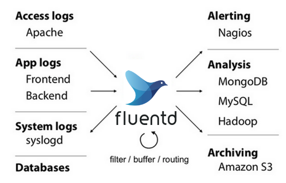
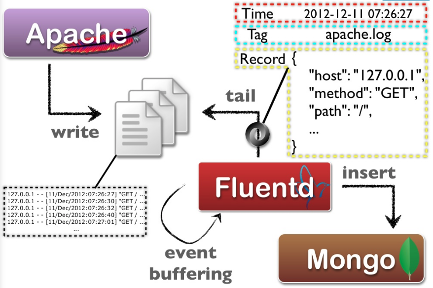

# Logging với Fluentd verison v1.x

## 1. Fluentd là gì?
Fluentd là một open-source và free cho phép thu thập và xử lý dữ log hiệu quả.

Fluentd được viết bằng Ruby và C nên sử dụng ít tài nguyên, khả năng scale tốt.



## 2. Kiến trúc tổng quan của Fluentd

Fluentd sẽ định dạng dữ liệu về dạng JSON, điều này cho phép fluentd có thể thống nhất tất cả các thao tác trong việc xử lý dữ liệu log: collecting (thu thập), lọc (filtering), ghi vào bộ nhớ đệm (buffering) và xuất dữ liệu (outputting) ra nhiều destination khác nhau.

Dưới đây là quá trình mà một event log được xử lý bởi fluentd.



Hình trên mô tả quá trình mà một event sẽ được xử lý.
- **Input** thu thập các event log từ các resource như `file`, `http`...Các event log này sau khi đi qua input plugin có định dạng Json gồm 3 phần: `time`, `tag` và `record`. Đây là một ví dụ về event log:
  ```
  2019-04-04 10:01:15 +0000 example.tag: {"action":"login","user":42} 
  ```
- **Engine (filter)** xử lí event log từ input gửi đến. Đó là một chuỗi các rule filter được áp dụng tới mỗi event log.
- Cuối cùng event log có thể đưọc lưu trữ trong buffer (file hoặc memory) và gửi đến các **Output** dựa vào `tag`. 

## 3. Cài đặt Fluentd với Docker
Mục này sẽ hướng dẫn cài đặt Fluentd bằng Docker và có một cấu hình đơn giản để tiếp nhận các log từ http request, sau đó output tới stdout.

- Tạo file `/tmp/fluent.conf` 
```
$ vi /tmp/fluent.conf
<source>
  @type http
  port 9880
  bind 0.0.0.0
</source>
<match **>
  @type stdout
</match>
```
- Cài Fluentd với câu lệnh `docker run`. 
```
$ docker run -d --name fluentd -p 9880:9880 -v /tmp:/fluentd/etc fluent/fluentd:stable
```
- Đẩy một sample log thông qua HTTP để verify
```
$ curl -X POST -d 'json={"json":"message"}' http://localhost:9880/sample.test
```
- Kết quả trong `docker logs`
```
$ docker logs --tail 50 -f fluentd
2019-04-03 15:49:54.361742463 +0000 sample.test: {"json":"message"}
```
Xem thêm cài đặt Fluentd bằng Docker [tại đây](https://hub.docker.com/r/fluent/fluentd/) 
Xem thêm các cách cài đặt khác [tại đây](https://docs.fluentd.org/v1.0/categories/installation) 


## 4. Cấu hình của Fluentd

### Cấu trúc thư mục cấu hình cơ bản
Tất cả quá trình xử lý này đều có thể được định nghĩa trong các file cấu hình. Đối với trường hợp fluentd phức tạp (nhiều source, filter và destination), một best practice có thể được áp dụng như sau:

```
├── etc
│   ├── filter
│   │   ├── 00-parse-syslog.conf
│   │   ├── ...
│   ├── input
│   │   ├── 00-syslog.conf
│   │   ├── ...
│   ├── output
│   │   └── 00-es.conf
│   └── fluent.conf
```
Theo cấu trúc này, project sẽ được tổ chức như sau:
- Thư mục `etc` chứa các file cấu hình cho project.
  - `fluent.conf` là file cấu hình chính của fluentd. File này sẽ sử dụng @include để import tất cả các file cấu hình khác từ các folder con là `filter/input/output`
  - Thông tin các đối tượng input, filter, output sẽ được định nghĩa trong các folder tương ứng.

Ví dụ về file `fluent.conf`:
```
# cat fluent.conf
@include input/*.conf
@include filter/*.conf
@include output/*.conf
```
Như vậy, khi chạy, fluentd sẽ đọc cấu hình từ file `fluent.conf` theo thứ tự từ trên xuống inpute --> filter --> output. Đầu tiên sẽ đọc cấu hình từ folder `input`, để xác định các resource cần tổng hợp log. Sau đó là folder `filter` cho việc xử lý log, nơi chứa các rule filter, rule parser. Và cuối cùng, folder `output` là các destination cần gửi output log sau khi được xử lý.

Xem  ví dụ mẫu  [tại đây](fa)

## 5. Tìm hiểu về Input Plugins cơ bản.

### Tổng quan
Input plugin chịu trách nhiệm retrieve và pull event logs từ các source. Một input plugin thông thường tạo một thread socket và một listen socket. Ngoài các input plugin có sẵn, ta cũng có thể tự viết một input plugin để pull data từ source mà mình định nghĩa. 

Fluentd hỗ trợ một số input plugin sau:
- in_tail
- in_forward
- in_udp
- in_tcp
- in_http
- in_syslog
- in_exec
- in_dummy
- in_windows_eventlog

Tiếp theo, ta sẽ đi tìm hiểu một số input plugin hay sử dụng  

### in_tail

Plugin `in_tail` cho phép Fluentd đọc các event log từ `tail of text file`, tương tự như khi sử dụng command `tail -F`. 

Khi Fluentd được cấu hình `in_tail`, nó sẽ bắt đầu đọc từ vị trí cuối cùng trong file log. Trong trường hợp Fluentd restart, nó sẽ tiếp tục đọc vị trí cuối cùng trước khi bị restart, vị trí này được lưu trong tham số `pos_file`. 

Dưới đây là ví dụ sử dụng `in_tail` plugin:
```
<source>
    @type tail
    path /fluentd/log/rails.log
    pos_file /fluentd/log/rails.out.pos
    read_lines_limit 700
    rotate_wait 5
    tag rails_log
    <parse>
        @type multiline
        format_firstline /^Started/
        format1 /Started (?<method>[^ ]+) "(?<path>[^"]+)" for (?<host>[^ ]+)\n/
        format2 /Processing by (?<controller>[^\u0023]+)\u0023(?<controller_method>[^ ]+) as (?<format>[^ ]+?)\n/
        format3 /(  Parameters: (?<parameters>[^ ]+)\n)?/
        format4 /  Rendered (?<template>[^ ]+) within (?<layout>.+) \([\d\.]+ms\)\n/
        format5 /Completed (?<code>[^ ]+) [^ ]+ in (?<runtime>[\d\.]+)ms \(Views: (?<view_runtime>[\d\.]+)ms \| ActiveRecord: (?<ar_runtime>[\d\.]+)ms\)/
    </parse>
</source>
```
Giải thích tham số:
- Trong `in_tail` input, 2 tham số `@type` và `<parse>` section là bắt buộc phải có, ngoài ra `pos_file` cũng được recommend nên sử dụng.
- `@type`:  quy định loại plugin sẽ sử dụng, ở đây là `tail`
- `path`: đường dẫn tới file cần `tail` log
- `pos_file`: ghi lại vị trí cuối cùng mà `in_tail` input đọc trong file.
- `read_line_limit`:  quy định số dòng sẽ đọc cho mỗi IO.
- `rotate_wait`: rotate là tiến trình tạo một file log mới, còn file log cũ sẽ được xử lí theo các quy định cấu hình như xóa/nén. Tham số này quy định khoảng thời gian giữ một tham chiếu tới file log cũ trước khi chuyển sang file log mới.
- `refresh_interval`: 
- `tag`: quy định tag, giúp phân loại các event log khác nhau. Được sử dụng trong `filter` và `output`
- `<parse>` section : giúp định dạng, phân tích cú pháp log. Fluentd sẽ dựa vào `parse` section để match, chỉ những đoạn log thỏa mãn mới được gắn tag và đươc xử lí tiếp. Chúng ta sẽ tìm hiểu kĩ hơn các `parse` plugin trong phần sau.

### in_syslog
Plugin `in_syslog` cho phép Fluentd nhận event log thông qua syslog protocol sử dụng UDP hoặc TCP.

Xem ví dụ dưới đây:
```
<source>
  @type syslog
  port 5140
  bind 0.0.0.0
  priority_key log_level
  source_hostname_key Hostname
  tag syslog
</source>
```

Ví dụ trên Fluentd tạo một socket lắng nghe trên port 5140. Để syslog daemon gửi message tới socket này, thêm cấu hình sau tới file `/etc/rsyslog.conf`. **Lưu ý**: cấu hình trên áp dụng nếu máy host sử dụng `rsyslogd`.  
```
# Send log messages to Fluentd
*.* @127.0.0.1:5140
``` 
Kết quả nhận được khi sử dụng `ssh` command như sau:
```
2019-04-15 23:38:14.000000000 +0000 syslog.auth.info: {"host":"DELL","ident":"systemd-logind","pid":"1075","message":"Removed session 27.","log_level":"info","Hostname":"172.22.0.1"}
```

Giải thích tham số:
- Fluentd lắng nghe tất cả các địa chỉ liên kết (`bind` 0.0.0.0) trên `port` 5140. 
- tag `syslog.auth.info` được tạo ra từ `{@tag}.#{facility}.#{priority}` 

## 6. Tìm hiểu về Output Plugins cơ bản.

### Tổng quan
Tiếp theo, ta sẽ đi tìm hiểu một số out  plugin hay sử dụng

### out_elasticsearch
Plugin `out_elasticsearch` cho phép Fluentd ghi các event log tới Elasticsearch.  Plugin này không có sẵn, ta cần cài thêm khi sử dụng với Dockerfile.
```
RUN sudo gem install fluent-plugin-elasticsearch
```
Xem ví dụ dưới đây:

```
<match *.log>
    @type elasticsearch
    host elasticsearch
    port 9200
    logstash_format true
    logstash_prefix example_log
    logstash_dateformat %Y.%m.%d 
    type_name access_log
</match>
```
Giải thích cấu hình:
- Fluentd sẽ ghi tất cả các event log có tag thỏa mãn `*.log` như `java.log`, `example.log` ... tới Elasticsearch ở `host` và `port` tương ứng.
- Khi set `logstash_format = false`, các event log được ghi lên Elasticsearch sẽ có `index_name` mặc định là `fluentd`. Nếu set  `logstash_format = true`, index_name sẽ được fomat theo định dạng `logstash_prefix-logstash_dateformat`. Tương ứng sẽ là **example_log-2019-04-14**

### out_copy
Plugin `out_copy` cho phép gửi cùng một  event log tới các output khác nhau. Ta có thể đồng thời ghi vào file và gửi tới elasticsearch.

```
<match pattern>
  @type copy
  <store ignore_error>
    @type file
    ...
  </store>
    @type stdout 
  <store>
    ...
  </store>
</match>
```
Với plugin `out_copy`, `store` tương ứng với một output. Nếu một `store` bị lỗi, nó sẽ ảnh hưởng tới `store` khác. Ta có thể thêm tham số `ignore_error` để bỏ qua lỗi và tiếp tục với các `store` khác.

## 7. Tìm hiểu về Filter Plugins cơ bản.


### Tổng quan

### filter_record_transformer

### filter_grep

### filter_parser


## 8. Tìm hiểu về Parser Plugins cơ bản


### Tổng quan

### parser_regexp

### parser_syslog


## 9. Tìm hiểu về Buffer Plugins


### Tổng quan (Phần này quan trọng vì cần để tuning performace sau này)

### buf_memory

### buf_file


## 10. Trouble Shooting

### Tối ưu hóa hiệu năng